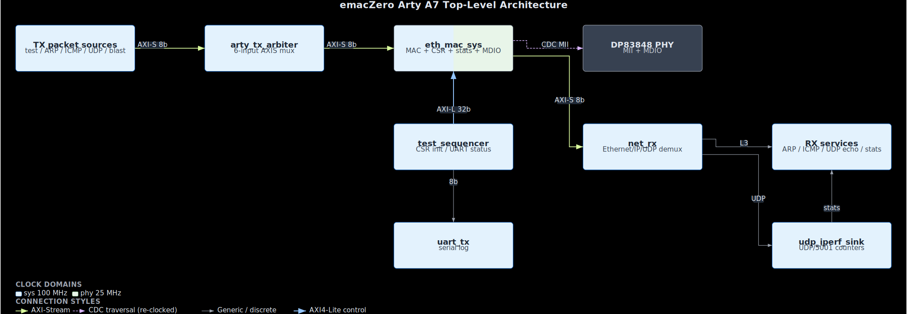
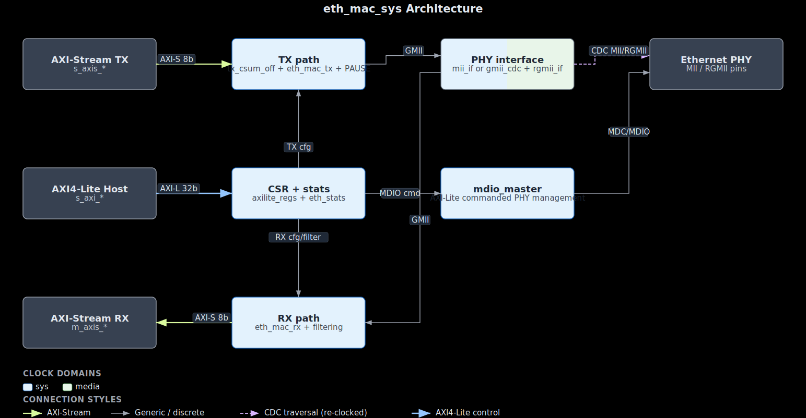

# emacZero

[](https://github.com/lcapossio/emacZero/actions/workflows/sim.yml?query=branch%3Amain)

Open-source Ethernet MAC in Verilog 2001. Supports 10/100/1G operation through
either MII (10/100 only) or RGMII (10/100/1G with runtime speed selection).
Provides AXI4-Stream interfaces, AXI4-Lite register control, MDIO management,
hardware statistics counters, jumbo-frame support, optional ICMP echo
responder, and optional IPv4/UDP TX checksum offload.

## Index

- [Features](#features)
- [Architecture](#architecture)
- [Module Hierarchy](#module-hierarchy)
- [Port Interface (eth_mac_sys.v)](#port-interface-eth_mac_sysv)
- [Register Map](#register-map)
- [Simulation](#simulation)
- [Hardware Test (Arty A7-100T)](#hardware-test-arty-a7-100t)
- [Integration](#integration)
- [Resource Usage](#resource-usage)
- [License](#license)
- [Author](#author)

## Features

- **AXI4-Stream TX/RX** - standard streaming interface for packet data with buffered RX backpressure
- **AXI4-Lite CSR** - control/status block with runtime MAC address, TX/RX enable, promiscuous mode, **runtime speed select (10/100/1G)**, full-duplex, jumbo-enable, TX-csum-offload
- **MII PHY interface** - 10/100 Mbps with store-and-forward async FIFOs
- **RGMII PHY interface** - 10/100/1G with **runtime speed selection** via `cfg_speed[1:0]` and parameterizable `RGMII_SPEEDS = "ALL" | "1G_ONLY" | "10_100"` for resource-conscious builds
- **Jumbo frames** - up to 9018 bytes (parameterizable `MAX_FRAME`)
- **TX checksum offload** - optional IPv4 header + UDP checksum patcher (`TX_CSUM_OFFLOAD=1`, `rtl/net/tx_csum_off.v`)
- **CRC-32** - IEEE 802.3 FCS generation (TX) and validation (RX)
- **MDIO master** - PHY register read/write, accessible through AXI4-Lite CSR
- **Statistics counters** - TX/RX frame count, byte count, CRC error count (32-bit saturating)
- **MAC address filtering** - unicast, broadcast, multicast hash filter (optional), promiscuous
- **Interrupt support** - TX done, RX frame, MDIO done with enable/mask
- **Minimum frame padding** - auto-pads to 64 bytes
- **Inter-frame gap** - 12-byte IFG enforcement
- **Vendor-agnostic** - DDR I/O wrappers for Xilinx/Intel/simulation, async FIFO wraps XPM or behavioral
- **Optional L3** - Ethernet/IP/ICMP/UDP RX parser, ICMP echo, UDP echo, UDP blast generator, and passive iperf2 sink/stat responder (`rtl/net/`)

## Architecture

Rendered block diagrams are clock-domain coloured and clickable for the full SVG.

[](docs/architecture.svg)

[](docs/eth_mac_sys_architecture.svg)

## Module Hierarchy

| Module | Description |
|--------|-------------|
| `eth_mac_sys.v` | **System wrapper**: CSR + stats + MAC + PHY IF + MDIO |
| `axilite_regs.v` | AXI4-Lite CSR block for configuration, counters, MDIO, multicast, and PAUSE |
| `eth_stats.v` | TX/RX frame, byte, and error counters |
| `eth_pause.v` | 802.3x PAUSE frame parser/generator |
| `eth_mac_tx.v` | TX path: preamble, SFD, data, padding, CRC, IFG |
| `eth_mac_rx.v` | RX path: preamble detect, data, CRC check, MAC filter |
| `mii_if.v` | MII PHY interface with store-and-forward CDC FIFOs |
| `sync_fifo.v` | Synchronous FIFO used by MAC RX/TX buffering |
| `gmii_cdc.v` | GMII clock domain crossing bridge (for RGMII mode) |
| `rgmii_if.v` | RGMII DDR interface using vendor-agnostic wrappers |
| `ddr_output.v` | Vendor-agnostic DDR output (Xilinx ODDR / Intel / behavioral) |
| `ddr_input.v` | Vendor-agnostic DDR input (Xilinx IDDR / Intel / behavioral) |
| `crc32.v` | IEEE 802.3 CRC-32 (reflected polynomial 0xEDB88320) |
| `async_fifo.v` | Async FIFO (XPM for Xilinx synthesis, behavioral for sim) |
| `mdio_master.v` | MDIO serial interface for PHY register access |
| `eth_mac.v` | Bare MAC wrapper (TX + RX + MII, no CSR) for simple designs |
| `tx_csum_off.v` | IPv4/UDP TX checksum insertion helper |
| `net_rx.v` | Ethernet/IPv4/ICMP/UDP parser used by the Arty demo |
| `icmp_echo.v` | ICMP echo responder |
| `udp_echo.v` | UDP echo responder |
| `udp_blast.v` | Line-rate UDP/iperf2-format packet generator |
| `udp_blast_trigger.v` | UDP/9997 control parser for `udp_blast` |
| `udp_iperf_sink.v` | Passive iperf2 UDP/5001 receiver/stat counter |
| `udp_stats_reply.v` | UDP/9996 binary stats query/clear responder |
| `arty_tx_arbiter.v` | Arty demo TX arbiter with blast-service holdoff |

## Port Interface (eth_mac_sys.v)

```verilog
module eth_mac_sys #(
    parameter PHY_INTERFACE     = "MII",  // "MII" or "RGMII"
    parameter MCAST_HASH_FILTER = 0,      // 1 = enable 64-bit multicast hash
    parameter MAX_FRAME         = 9018,   // jumbo MTU + Ethernet headers
    parameter TX_CSUM_OFFLOAD   = 0,      // 1 = synthesize checksum patcher
    parameter MII_DEBUG         = 0       // 0 = debug capture/counters off
)(
    input  wire        clk,           // system clock (100 MHz)
    input  wire        rst_n,

    // AXI4-Lite CSR (32-bit data, 8-bit byte address)
    input  wire [7:0]  s_axi_awaddr, s_axi_araddr,
    // ... standard AXI4-Lite signals ...

    // AXI4-Stream TX (from network stack)
    input  wire [7:0]  s_axis_tdata,
    input  wire        s_axis_tvalid,
    output wire        s_axis_tready,
    input  wire        s_axis_tlast,

    // AXI4-Stream RX (to network stack)
    output wire [7:0]  m_axis_tdata,
    output wire        m_axis_tvalid,
    input  wire        m_axis_tready,
    output wire        m_axis_tlast,
    output wire        m_axis_terror,  // CRC error
    output wire        m_axis_tsof,    // start of frame

    // MII PHY pins (PHY_INTERFACE="MII")
    output wire [3:0]  mii_txd,
    output wire        mii_tx_en,
    input  wire        mii_tx_clk, mii_rx_clk,
    input  wire [3:0]  mii_rxd,
    input  wire        mii_rx_dv, mii_rx_er,
    input  wire        mii_col, mii_crs,

    // RGMII PHY pins (PHY_INTERFACE="RGMII")
    input  wire        clk_125, clk_125_90,
    input  wire        clk_25,           // 100M reference (cfg_speed=01)
    input  wire        clk_2_5,          // 10M reference (cfg_speed=10)
    output wire [3:0]  rgmii_txd,
    output wire        rgmii_tx_ctl, rgmii_txc,
    input  wire [3:0]  rgmii_rxd,
    input  wire        rgmii_rx_ctl, rgmii_rxc,

    // MDIO
    output wire        mdc,
    input  wire        mdio_i,
    output wire        mdio_o, mdio_oe,

    // Interrupt
    output wire        irq
);
```

`MII_DEBUG` defaults off. When enabled it keeps low-level MII capture counters
alive inside `mii_if` / `eth_mac` for testbench or bring-up probes; the
system wrapper (`eth_mac_sys`) does not export a board-level debug bus.

## Register Map

| Offset | Name | R/W | Description |
|--------|------|-----|-------------|
| 0x00 | VERSION | RO | 0x0001454D: [31:24] major [23:16] minor [15:0] ID `"EM"` |
| 0x04 | CTRL | RW | [0] tx_en [1] rx_en [2] promisc [4:3] speed (00=1G,01=100M,10=10M) [5] full_duplex (informational; FD-only MAC) [6] jumbo_en [7] tx_csum_off [8] passthrough |
| 0x08 | STATUS | RO | [0] tx_active [1] tx_fifo_busy [2] mdio_busy |
| 0x0C | MAC_LO | RW | MAC address [31:0] |
| 0x10 | MAC_HI | RW | MAC address [47:32] |
| 0x14 | MDIO_CMD | RW | [4:0] reg/devad [9:5] phy [10] write [11] go [12] c45_en [14:13] c45_op |
| 0x18 | MDIO_WDATA | RW | [15:0] MDIO write data |
| 0x1C | MDIO_RDATA | RO | [15:0] MDIO read data |
| 0x20 | IRQ_EN | RW | [0] tx_done [1] rx_frame [2] mdio_done |
| 0x24 | IRQ_STATUS | W1C | Same bits as IRQ_EN, write-1-to-clear |
| 0x28 | TX_FRAME_CNT | RO/WC | TX frame counter (write-any-to-clear) |
| 0x2C | TX_BYTE_CNT | RO/WC | TX byte counter |
| 0x30 | RX_FRAME_CNT | RO/WC | RX frame counter |
| 0x34 | RX_BYTE_CNT | RO/WC | RX byte counter |
| 0x38 | RX_ERR_CNT | RO/WC | RX CRC error counter |
| 0x3C | SCRATCH | RW | Read-back test register |
| 0x44 | MCAST_LO | RW | mcast_hash_table[31:0] (only if MCAST_HASH_FILTER=1) |
| 0x48 | MCAST_HI | RW | mcast_hash_table[63:32] (only if MCAST_HASH_FILTER=1) |
| 0x4C | RX_ERR_ALIGN | RO/WC | RX frames with `rx_er` asserted |
| 0x50 | RX_ERR_OVERFLOW | RO/WC | RX frames lost to FIFO overflow |
| 0x54 | RX_ERR_OVERSIZE | RO/WC | RX frames longer than current MAX |
| 0x58 | RX_BCAST | RO/WC | RX broadcast frames |
| 0x5C | RX_MCAST | RO/WC | RX multicast frames |
| 0x60 | RX_SIZE_64 | RO/WC | RX frames exactly 64 wire bytes |
| 0x64 | RX_SIZE_65_127 | RO/WC | RX frames 65-127 bytes |
| 0x68 | RX_SIZE_128_255 | RO/WC | RX frames 128-255 bytes |
| 0x6C | RX_SIZE_256_511 | RO/WC | RX frames 256-511 bytes |
| 0x70 | RX_SIZE_512_1023 | RO/WC | RX frames 512-1023 bytes |
| 0x74 | RX_SIZE_1024_1518 | RO/WC | RX frames 1024-1518 bytes |
| 0x78 | RX_SIZE_JUMBO | RO/WC | RX frames > 1518 bytes |
| 0x84 | PAUSE_CTRL | RW | [0] tx_send [1] rx_en |
| 0x88 | PAUSE_QUANTA | RW | [15:0] quanta for next emitted PAUSE frame |
| 0x8C | PAUSE_RX_CNT | RO/WC | Received PAUSE frames |
| 0x90 | PAUSE_TX_CNT | RO/WC | Transmitted PAUSE frames |

Default CTRL: tx_en=1, rx_en=1, promisc=0, speed=00 (1G), full_duplex=1,
jumbo_en=0, tx_csum_off=0, passthrough=0  ->  0x23.
Default MAC: 02:00:00:00:00:01 (locally administered).

## Simulation

Requires [Icarus Verilog](http://iverilog.icarus.com/) (`iverilog` + `vvp` in
PATH), Verilator (`verilator` in PATH, or WSL `verilator` on Windows), and
Python 3. The normal test command runs Icarus lint, Verilator lint, and the full
directed simulation regression; Verilator runs before simulation so interface
drift such as missing module pins is caught early.

```bash
python build_and_test.py
```

### Test Suite

| Test | Description | Checks |
|------|-------------|--------|
| CRC32 | Known test vectors, residue verification | 3 |
| ASYNC-FIFO | Async FIFO pointer, full/empty, wraparound behavior | 11 |
| ETH-MAC-FCS | FCS generation for multiple frame sizes | 4 |
| ETH-MAC-MULTIFRAME | Back-to-back frames, minimum padding, IFG | 1 |
| ETH-MAC-JUMBO | Jumbo-frame TX/RX behavior | 6 |
| MII-TX-BRIDGE | GMII-to-MII byte-to-nibble conversion | 1 |
| MII-TX-BURST-BACKPRESSURE | MII TX burst pacing under downstream stalls | 4 |
| MII-STORE-FORWARD | Store-and-forward CDC, frame toggle | 7 |
| MII-LOOPBACK | Full TX-to-RX loopback through MII | 1 |
| MII-RX-REPLAY-STRESS | RX frame-ready accounting under replay stalls | 7 |
| ETH-STATS | Statistics counters: increment, saturation, clear | 19 |
| AXILITE-REGS | AXI4-Lite CSR: all register behaviors | 32 |
| GMII-CDC | GMII CDC bridge: loopback, data integrity, back-to-back | 7 |
| ETH-MAC-SYS | Full integration: AXI-Lite config, MII loopback, stats, MDIO | 10 |
| RGMII-IF | RGMII DDR pin packing/unpacking at 1G | 14 |
| RGMII-IF-100M | 100M nibble pairing through RGMII loopback | 2 |
| MCAST-FILTER | Multicast hash filter accept/drop behavior | 6 |
| ETH-MAC-RX-BACKPRESSURE | RX path holds frames when downstream stalls | 3 |
| ETH-MAC-RX-JUMBO-GATE | RX jumbo enable/disable length gate | 3 |
| ETH-MAC-RX-BYTE0 | RX byte-zero/start-of-frame handling | 4 |
| MDIO-MASTER | MDIO master read/write protocol, 1-bit shift fix | 10 |
| TX-CSUM-OFF | Inline IPv4/UDP TX checksum offload patcher | 5 |
| NET-RX | Ethernet/IPv4/ICMP/UDP parser coverage | 16 |
| ICMP-ECHO | ICMP echo responder packet generation | 35 |
| UDP-IPERF-SINK | iperf2 UDP header parsing, counters, gap tracking | 16 |
| UDP-BLAST-TRIGGER | trigger payload parsing and busy/port filtering | 13 |
| UDP-BLAST-START-DELAY | First-packet delay after UDP blast trigger | 7 |
| ARTY-TX-ARBITER | Arty six-source TX arbitration and blast holdoff | 9 |
| UDP-BLAST-PATH | UDP trigger frame through `net_rx` into `udp_blast` TX | 9 |
| UDP-STATS-REPLY | binary stats query/clear responder packet generation | 19 |
| ETH-MAC-SYS-CSUM | Integrated TX checksum-offload path with `TX_CSUM_OFFLOAD=1` | 7 |
| ETH-MAC-SYS-CSUM-BYPASS | Default `TX_CSUM_OFFLOAD=0` path ignores `CTRL[7]` and preserves checksums | 6 |
| ETH-MAC-SYS-JUMBO | Integrated jumbo-frame system path | 3 |
| GMII-CDC-100M | 100M rate adaptation pacing in gmii_cdc | 4 |
| GMII-CDC-10M | 10M rate adaptation pacing in gmii_cdc | 4 |
| RGMII-IF-VARIANTS | RGMII speed/DDR variant handling | 6 |
| RGMII-LOOPBACK | Full system + RGMII PHY loopback at 1G | 5 |

## Hardware Test (Arty A7-100T)

The Digilent Arty A7-100T hardware test uses the onboard TI DP83848J MII
Ethernet PHY. Build, program, UART, LED, fcapz submodule, ARP/ICMP, UDP echo,
UDP blast, host-to-FPGA iperf sink, bidirectional UDP, regression profile, and
troubleshooting details are canonical in
[fpga/arty_a7/README.md](fpga/arty_a7/README.md).

Current Arty A7-100T hardware throughput, measured on 2026-05-28 with the
DP83848J MII PHY at 100 Mbps full duplex and 1472-byte UDP payloads:

| Test | Result |
|------|--------|
| 5 s bidirectional smoke | PASS, FPGA->host 95.16 Mbps, host->FPGA 70.00 Mbps, 0 gaps |
| 60 s bidirectional stress | PASS, FPGA->host 95.15 Mbps, host->FPGA 95.71 Mbps, 0 gaps |

These are UDP payload Mbps, not raw wire Mbps. Around 95 Mbps payload is
expected on a 100 Mbps Ethernet link once preamble, IFG, headers, and FCS are
included.

## Integration

Drop `eth_mac_sys` into another design via either of:

**FuseSoC** — see [emaczero.core](emaczero.core). Targets:

| Target | Top | Filesets |
|--------|-----|----------|
| `default` | `eth_mac_sys` | MAC IP only |
| `with_l3` | `eth_mac_sys` | + ICMP echo / IP RX parser |
| `arty_a7` | `arty_a7_top` | full demo + XDC |

```bash
fusesoc run --target=default bard0:eth:emaczero
```

**Plain filelist** — for tools without FuseSoC:

```bash
iverilog -g2001 -I rtl -f rtl/eth_mac_sys.f your_top.v
```

[rtl/eth_mac_sys.f](rtl/eth_mac_sys.f) covers the MAC IP;
[rtl/eth_mac_sys_l3.f](rtl/eth_mac_sys_l3.f) adds the optional L3 helpers.
`-I rtl` is required because [`axilite_regs.v`](rtl/axilite_regs.v) does
`` `include "version.vh" `` (single source of truth — see *Versioning* below).

**LiteX** — `litex_emaczero/emaczero.py` ships an `EmacZero` `LiteXModule` that wraps
`eth_mac_sys` with LiteX-native AXI-Lite + AXI-Stream interfaces:

```python
from litex_emaczero import EmacZero, add_sources
from litex.soc.interconnect import axi
from litex.soc.integration.soc import SoCRegion

add_sources(platform)
self.submodules.mac = mac = EmacZero(platform, platform.request("eth"),
                                     phy_interface="MII")
self.bus.add_slave("emaczero",
    axi.AXILite2Wishbone(mac.s_axi).wishbone,
    SoCRegion(origin=0x6000_0000, size=0x100, mode="rw"))
self.add_interrupt("emaczero")
```

Supports MII and RGMII, configurable `MAX_FRAME` and multicast hash, MDIO
exposed as a `TSTriple`, and optional `TX_CSUM_OFFLOAD`. See module docstring in
[litex_emaczero/emaczero.py](litex_emaczero/emaczero.py) for the full pad contract.

### Bare-metal driver

C99 driver in [sw/emaczero/](sw/emaczero/) — register offsets, MDIO
read/write, MAC-address setter, IRQ ack. Two files (`emaczero.h` +
`emaczero.c`), no malloc, no OS calls. See [sw/README.md](sw/README.md).

### Minimal instantiation template

[examples/eth_mac_sys_minimal/](examples/eth_mac_sys_minimal/) is a
copy-paste wrapper that exposes every host-side port (AXI-Lite, AXI-Stream
TX/RX, MII / RGMII, MDIO, IRQ) with no demo logic — useful as a starting
point when wiring the MAC into your own SoC.

### AXI-Stream store-forward boundary

`emacZero` exposes byte-wide AXI4-Stream TX/RX ports, but this repository does
not include a separate `axis_store_forward` block. That block is useful in a
larger SoC when a DMA or packet producer can start a TX frame and then starve
before `tlast`; it belongs at that parent-system AXI-Stream boundary.

Inside this IP, the MII path already has its own frame-aware CDC buffering:
MII RX stores a complete frame before replaying it into the system clock
domain, and MII TX carries the frame boundary as an EOF sideband bit in its
CDC data FIFO before driving the PHY.
For normal standalone `eth_mac_sys` integration, do not add an external
`axis_store_forward` dependency unless your upstream producer cannot meet the
AXI-Stream frame contract under backpressure.

The checked-in Arty A7 design also has no Xilinx MIG/DDR controller. It uses
the board 100 MHz clock as `sys_clk`, the onboard DP83848J MII PHY, and local
clock generation only for the MAC/PHY logic.

### Continuous integration

[.github/workflows/sim.yml](.github/workflows/sim.yml) runs
`python build_and_test.py` (lint + the full Icarus Verilog regression) on
every push and PR to `main`.

## Resource Usage

Current measured numbers are from the routed Arty A7-100T reference build:
Vivado 2025.2, `xc7a100tcsg324-1`, `PHY_INTERFACE="MII"`, `MII_DEBUG=0`,
`TX_CSUM_OFFLOAD=0`, full demo logic enabled, generated on 2026-05-28 after
the RX AXIS FIFO BRAM inference fix, MII EOF-sideband FIFO cleanup, and XPM
FIFO advanced-feature trim.

| Scope | LUTs | FFs | RAMB36 | RAMB18 | DSP | Notes |
|-------|-----:|----:|-------:|-------:|----:|-------|
| Full `arty_a7_top` | 9,912 | 19,252 | 4 | 1 | 0 | MAC + ARP/ICMP/UDP demo + UART/sequencer |
| `u_mac_sys` hierarchy | 1,859 | 1,800 | 4 | 1 | 0 | CSR, stats, MAC, MII, MDIO, pause |
| `gen_mii.u_mii_if` | 342 | 707 | 3 | 1 | 0 | MII CDC FIFOs with EOF sideband, debug disabled |
| `u_mac_rx` | 201 | 212 | 1 | 0 | 0 | Default synchronous RX AXIS FIFO inferred as BRAM |
| `u_mac_tx` | 246 | 111 | 0 | 0 | 0 | TX preamble/FCS/IFG path |

Post-route timing met with WNS `0.236 ns` on the full Arty top. The generated
reports live under `build_arty/` (`utilization_route.rpt`,
`utilization_hier_route.rpt`, `timing.rpt`, `timing_summary_route.rpt`) and
are intentionally ignored by git as build artifacts.

The table above is not a standalone IP resource matrix. Exact standalone
`eth_mac`, `eth_mac_sys` MII, and `eth_mac_sys` RGMII reports need dedicated
synthesis harnesses; until those exist, use the Arty hierarchy numbers as the
checked measurement and treat old standalone estimates as superseded.

## Versioning

The MAJOR/MINOR/ID values that build the VERSION CSR (`0x00`) are defined
exactly once in [`rtl/version.vh`](rtl/version.vh):

```verilog
`define EMZ_VERSION_MAJOR 8'h00
`define EMZ_VERSION_MINOR 8'h01
`define EMZ_VERSION_ID    16'h454D  // ASCII "EM"
```

`axilite_regs.v` `` `include "version.vh" `` builds the 32-bit constant from
the three defines, so the simulator and synthesised CSR always agree.

Two derived files mirror the same numbers:

- [`sw/emaczero/emaczero.h`](sw/emaczero/emaczero.h) — `EMZ_VERSION_MAJOR /
  MINOR / ID` for the bare-metal driver.
- [`emaczero.core`](emaczero.core) — `name: bard0:eth:emaczero:<MAJOR>.<MINOR>.0`
  for FuseSoC.

`build_and_test.py`'s `PHASE 0a: Version consistency` parses all three on
every run and fails if they disagree, so you cannot ship a mismatched bump.
To change the version, edit `rtl/version.vh` and update the two mirrored
constants in lockstep.

## License

Apache-2.0. See [LICENSE](LICENSE) for details.

## Author

Leonardo Capossio - [bard0 design](www.bard0.com) - hello@bard0.com
